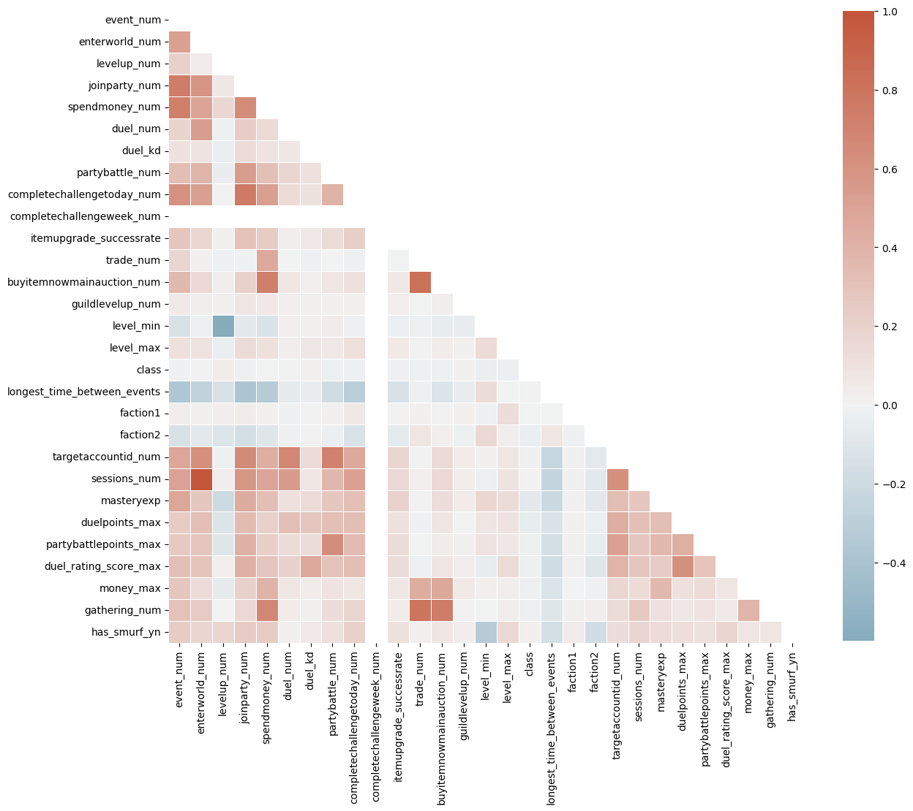
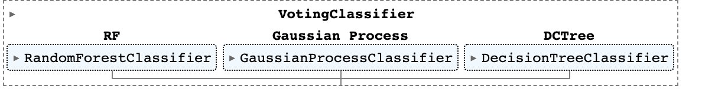

###### 2022-dis29-team4
# Documentation <br>
-> https://THKoeln-DIS29.github.io/2022-dis29-team4/

For the entire Pages expirience please use mkdocs locally, cant get it to work online :(


# Documentation

#### Welcome to Team 4's CLI Documentation

To use the CLI, you need to launch the following command:
```
python main.py 
```
To get an overview of the commands and functions available,
you can run:
```
python main.py --help
```
To use one of the availible commands f.e. use:
```
python main.py correlations
```


----------------------------------------------------------------

# Commands
<span style="font-size:1em;">
An overview of all functionalities is provided in the following section.
</span>
----------------------------------------------------------------

## Preprocess the Trainingdata
```
python main.py pre_processing
```
### ::: main.pre_processing
For the sourcecode of the pre-processing of the training data look here:
##### ::: preprocessing.pre_pro
----------------------------------------------------------------
## Correlations Map
```
python main.py correlations
```
### ::: main.correlations
<span style="font-size:1em;">
How the heatmap might look like:<br>
</span>

<br>


----------------------------------------------------------------
## Make a Gridsearch
```
python main.py grid_search
```

----------------------------------------------------------------
## Preprocess the Testdata
```
python main.py pre_processing_eval
```

----------------------------------------------------------------
## Train the Votingclassifier
```
python main.py votingclassifier
```
<span style="font-size:1em;">
Votingclassifier setup in Sci-Kit learn:<br>
</span>

<br>


----------------------------------------------------------------
## Apply the model
```
python main.py applymodel
```

----------------------------------------------------------------

